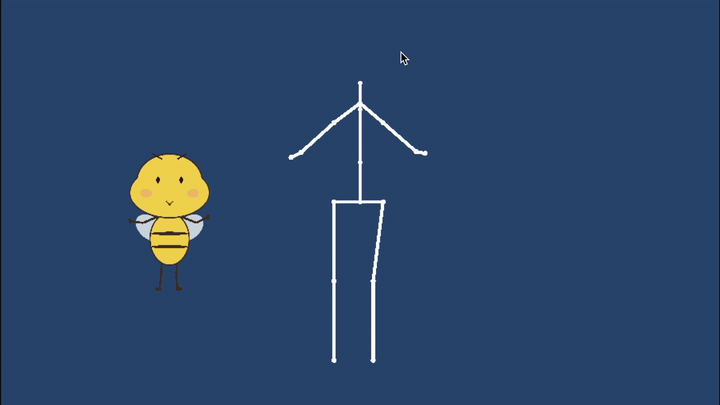
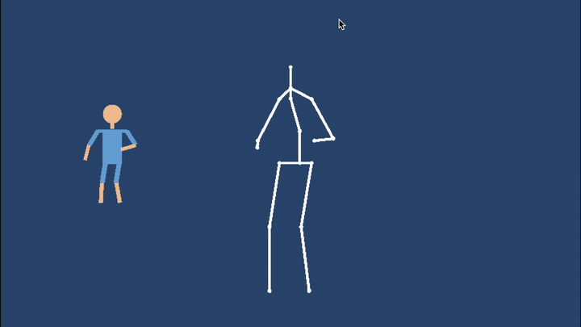
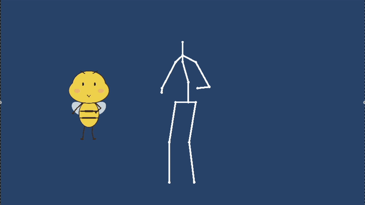
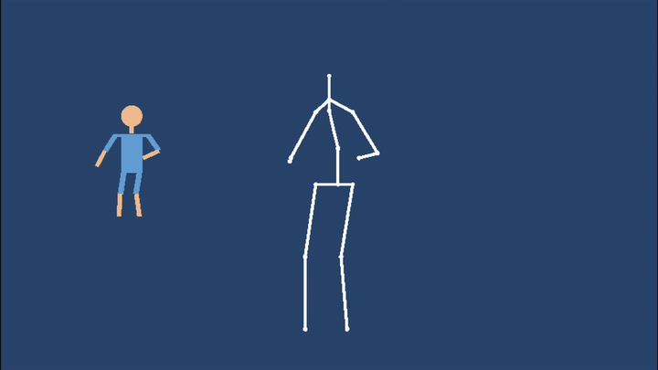

# Human Motion Video to Unity 2D Character Animation

A three-stage pipeline that converts human motion video into Unity 2D character animation through pose estimation, motion stabilization, and character rig mapping.

This repository contains the Unity mapping and character-driving module developed as part of a three-person university project.

## Results

The following animations demonstrate the Unity output using two different 2D characters.

### Character Animated in Place

| Bee Character | Human Character |
|:---:|:---:|
|  |  |

### Character Following the Skeleton Movement

| Bee Character | Human Character |
|:---:|:---:|
|  |  |

## Project Presentation

[▶ Watch the project presentation](https://github.com/0226Yan/human-motion-video-to-unity-2d-animation/releases/latest/download/project-video.mp4)

The presentation introduces the complete project pipeline, including pose estimation, motion stabilization, and Unity 2D character driving.

## System Pipeline

```text
Human Motion Video
        ↓
Pose Estimation
        ↓
Joint Coordinate Sequence
        ↓
Motion Stabilization
        ↓
Processed JSON Pose Data
        ↓
Unity 2D Skeleton
        ↓
Character Rig Mapping
        ↓
Unity 2D Character Animation

## Unity Module

The Unity module reads processed pose data from JSON files and converts it into 2D character animation.

During playback, the module:

1. Reads joint coordinates frame by frame.
2. Updates a Unity skeleton consisting of 17 joints.
3. Calculates the position, rotation, and length of each bone segment.
4. Maps the skeleton motion to the corresponding character body parts.
5. Displays the resulting 2D character animation.

The character can either remain at a fixed position or follow the relative movement of the source skeleton. The same pose data can also be applied to different character rigs through configurable body-part mappings.

## Core Scripts

| Script | Description |
|---|---|
| [`PureSkeletonPlayer.cs`](src/PureSkeletonPlayer.cs) | Loads processed JSON pose data, updates 17 skeleton joints frame by frame, and calculates the position, rotation, and length of each bone segment. |
| [`CharacterRigAdapter.cs`](src/CharacterRigAdapter.cs) | Maps the generated skeleton motion to the character's head, torso, arms, and legs, with configurable rig mappings and position-following behaviour. |
| [`HideSkeletonVisuals.cs`](src/HideSkeletonVisuals.cs) | Hides the control skeleton during playback so that only the animated character is displayed. |

## My Contribution

This project was completed by a three-person team. My work focused on the **Unity Mapping and Character Driving** module, including:

- Constructing the 17-joint control skeleton in Unity
- Implementing frame-by-frame JSON pose-data playback
- Calculating bone positions, rotations, and lengths
- Mapping skeleton motion to character body parts
- Configuring character rigs through the Unity Inspector
- Supporting both fixed-position and movement-following animation
- Testing the same pose data with two different 2D characters

The pose-estimation and motion-stabilization modules were completed by other team members.

## Technologies

- Unity
- C#
- JSON
- Unity Transform System
- 2D Skeletal Animation
- Character Rig Mapping

## Repository Structure

```text
unity-2d-pose-animation/
├── README.md
├── src/
│   ├── PureSkeletonPlayer.cs
│   ├── CharacterRigAdapter.cs
│   └── HideSkeletonVisuals.cs
└── docs/
    ├── Bee_after_smooth.gif
    ├── Human_after_smooth.gif
    ├── Move_Bee_after_smooth.gif
    ├── Move_Human_after_smooth.gif
```

## Repository Scope

This repository contains the C# scripts and presentation media for the Unity mapping and character-driving module.

It does not include the complete original Unity project or the source code for the pose-estimation and motion-stabilization modules.
